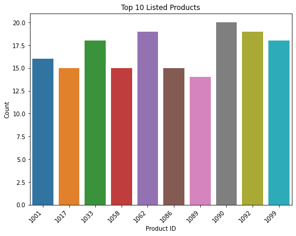
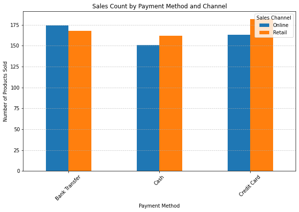
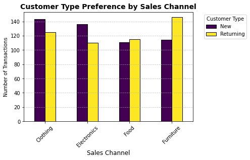

# **Sales Report Analysis**

## Business Overview

The sales department plays a crucial role in driving business growth and sustainability. Analyzing sales data provides valuable insights into product demand, regional sales trends, and category performance in terms of the products. It also helps identify top-performing sales representatives who contribute significantly to revenue generation.

These insights can be leveraged to:

* Recognize and reward high-performing sales representatives.

* Optimize procurement and supply chain decisions based on demand trends.

* Strategically allocate resources to maximize sales opportunities and profitability.

## Business Problem

Stakeholders at Jenny’s Enterprise seek insights into sales performance to optimize business strategies. They are particularly interested in identifying the best-selling products, preferred sales channels, and underperforming regions to enhance sales and improve customer satisfaction.

To achieve this, they have tasked me with analyzing the sales dataset to answer the following key questions:

* Which are the top 10 fast-moving products?

* Which sales channel do customers prefer, and how can the company optimize it?

* Which region has the lowest sales, and what strategies can improve performance there?

* What is the overall customer satisfaction rate?

## Data Understanding

The Dataset was downloaded from kaggle under the link: https://www.kaggle.com/datasets/vinothkannaece/sales-dataset?resource=download. It contains 1000 rows and 14 columns and is in a csv format. During the data understanding we note that the data did not have any duplicates, no missing values and outliers.

### Top 10 Fast Moving Products

**Findings**

* Product id 1090 has the highest records of 20 rows followed by 1062 and 1092 at 19 and 1099 and 1033 at 18 respectively indicating that they were the most sold products.

* The least sold products are 1040, 1011, 1041, 1083 and 1031 respectively in that order.

### Channels of Purchase

    

* 512 products were sold via the retail channel and 488 products via the online platform.

### Payment Channel Preference

**Findings**

* Most of the Credit Card Users prefer the retail sale channel similar to the cash payment option which is the general assumption.

* The customers that pay via Bank Transfers prefer the online platform.

### Customer Type Preference by Sales Channel

**Findings**

* Most of the returning clients purchased Furnitures and new customers purchased clothings.

### Region Based Sales

**Findings**

* The South region had the lowest sales and the North recorded the highest sales.

### Sales Rep Performance

**Findings**

* David was our best performing sales agent with 222 sales followed by Eve at 209 sales.

## Data Limitations

* A short description of the product besides the product ID and the category would have enabled us to do a deep dive on the sales analysis.

* Historical sales data per representative would have allowed for trend analysis and performance evaluation over time.

## Conclusions & Recommendations

* The top 10 fast moving products are as indicated: 1090, 1062, 1092, 1099, 1033, 1001, 1086, 1058, 1017 and 1089 respectively. This implies that the company ought to ensure this products are well stacked to ensure continuous sales. The least purchased item was 1031. Maybe a discount on the product or better marketing strategies should be implemented to promote its movement. Among the top 10 products product ID 1099 made the highest sales.

* Most customers prefer retail than online shopping. We therefore should ensure that we have enough employees to attend to the customers at the physical store. Most of the retail buyers prefered using the method of payment as Credit cards. Most of the returning customers prefered retail shopping. Further investigations should be done to access why most customers prefer retail to online shopping. Possible reasons: Delayed response, proximity or just the personal interactions with the customers at the shops as we note most of them are returning customers signifying customer satisfaction. 

* From the analysis, we note the lowest selling region was South region while the region with the most sales was the North. More marketing should be done in the South region to increase the number of sales.

* Most of the returning customers purchase the furnitures. Most of the new customers purchase clothings. There is not a significant difference between the new and the returning customers. This possibly suggests that the customers are generally satisfied with the service and products and through referrals, the company gets to have the new customers as well. More focus should be put in to ensure customer satisfaction even after the sale is made as well as loyalty programs.

